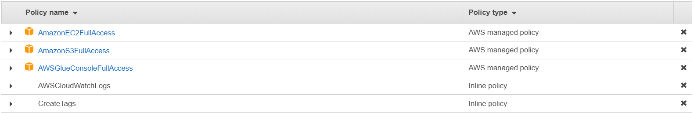
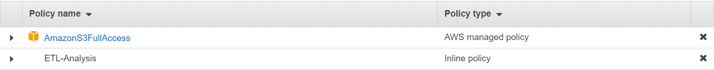
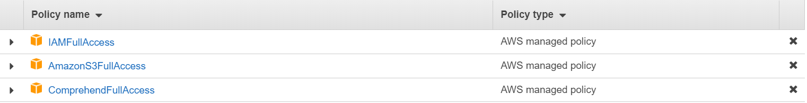
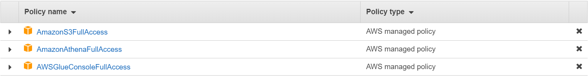

## Create IAM roles

Please check each of following roles has been created.
IAM roles allows you to delegate access with defined permissions to trusted entities without having to share long-term access keys.


### IAM role for AWS Glue

1. On the **service** menu, click **IAM**.

2. In the navigation pane, choose **Roles**.

3. Click **Create role**.

4. For role type, choose **AWS Service**, find and choose **Glue**, and choose **Next: Permissions**.

5. On the **Attach permissions policy** page, search and choose **AmazonS3FullAccess, AWSGlueConsoleFullAccess**, **AmazonEC2FullAccess**, click **Next: Tags**, and **Next: Review**.

6. On the **Review** page, enter the following detail:
**Role name: AWSGlueServiceRoleDefault**

7. Click **Create role**.

8. Choose **Roles** page, select the role **AWSGlueServiceRoleDefault** you just created.

9. On the **Permissions** tab, choose the link **add inline policy** to create an inline policy.

10. On the JSON tab, paste in the following policy:

```
{
    "Version": "2012-10-17",
    "Statement": [
        {
           "Effect": "Allow",
           "Action": [
             "logs:CreateLogGroup",
             "logs:CreateLogStream",
             "logs:PutLogEvents",
             "logs:DescribeLogStreams"
            ],
            "Resource": [
                "arn:aws:logs:*:*:*"
            ]
        }
    ]
}
```

11. Click **Review policy**.

12. On the Review policy, enter policy name: **AWSCloudWatchLogs**.

13. Click **Create policy**.

14. Click the link **add inline policy** to create an inline policy.

15. On the JSON tab, paste in the following policy:

```
{
    "Version": "2012-10-17",
    "Statement": [
        {
            "Sid": "VisualEditor0",
            "Effect": "Allow",
            "Action": [
              "ec2:DeleteTags",
              "ec2:CreateTags"
            ],
            "Resource": "*"
        }
    ]
}
```

16. Click **Review policy**.

17. On the Review policy, enter policy name: **CreateTags**.

18. Click **Create policy**.

19. Now confirm you have policies as below figure.



You successfully create the role that allow AWS Glue get access to S3.<br><br>

### IAM role for automated ETL job using AWS Lambda

1. Back to the navigation pane, choose **Roles**.

2. Click **Create role**.

3. For role type, choose **AWS Service**, find and choose **Lambda**, and choose **Next: Permissions**.

4. On the **Attach permissions policy** page, search and choose **AmazonS3FullAccess**, click **Next: Tags**, and **Next: Review**.

5. On the **Review** page, enter the following detail:
**Role name: LambdaAutoETL**

6. Click **Create role**.

7. Choose **Roles** page, select the role **LambdaAutoETL** you just created.

8. On the Permissions tab, choose the link **add inline policy** to create an inline policy.

9. On the JSON tab, paste in the following policy:

      {
         "Version": "2012-10-17",
         "Statement": [
             {
                 "Sid": "VisualEditor0",
                 "Effect": "Allow",
                 "Action": [
                     "athena:*",
                     "glue:*"
                 ],
                 "Resource": "*"
             }
         ]
       }

10. Click **Review policy**.

11. On the Review policy, enter policy name: **ETL-Analysis**

12. Click **Create policy**.

13. Now confirm you have policies as below figure.


You successfully create the role that allow Lambda trigger ETL job automatically with AWS Glue by object put event of S3.<br><br>

### IAM role for Amazon Comprehend job

1. Back to the navigation pane, choose **Roles**.

2. Click **Create role**.

3. For role type, choose **AWS Service**, find and choose **Lambda**, and choose **Next: Permissions**.

4. On the **Attach permissions policy** page, search and choose **AmazonS3FullAccess, IAMFullAccess, ComprehendFullAccess**, click **Next: Tags**, and **Next: Review**.

5. On the **Review** page, enter the following detail:
**Role name: Comprehend-Job**

6. Click **Create role**.

7. Choose **Roles** page, select the role **Comprehend-Job** you just created.

8. On the **Permissions** tab, now confirm you have policies as below figure.



You successfully create the role that allow Lambda trigger topic detection job automatically with Amazon Comprehend by object put event of S3.<br><br>

### IAM role for Redshift

1. Back to the navigation pane, choose **Roles**.

2. Click **Create role**.

3. For role type, choose **AWS Service**, find and choose **Redshift**, and choose **Redshift – Customizable** below then click **Next: Permissions**.

4. On the **Attach permissions policy** page, search and choose **AmazonS3FullAccess, AmazonAthenaFullAccess, AWSGlueConsoleFullAccess**, click **Next: Tags**, and **Next: Review**.

5. On the **Review** page, enter the following detail:
**Role name: SpectrumRole**

6. Click **Create role**.

7. Choose **Roles** page, select the role **SpectrumRole** you just created. Now confirm you have below figure.



### You successfully create the role for Redshift clusters to call S3, Athena and Glue service.

### And you can go further.