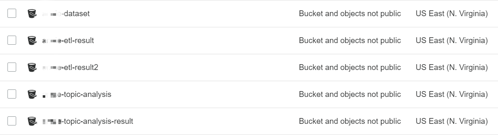

# Developer scraping the data and store it into S3

In this tutorial, we will create IAM roles for multiple AWS services, whcih is a web service that helps you securely control access to AWS resources. You use IAM to control who is authenticated (signed in) and authorized (has permissions) to use resources. After roles created, we will create S3 buckets and upload sample data (trending YouTube video data).

## Prerequisites

* Make sure the region is **US East (N. Virginia)**, which its short name is **us-east-1**.

* Download this **repository** and unzip, ensure that **data** folder including three files:

    * USvideos.csv
    * US-category-id.json
    * word_analysis.csv

   > Please download completely folder from Github, click **Clone or download** which is **green icon** on upper right corner, and choose **Download ZIP**.

## Create S3 bucket to store data

This part will create five bucket, each bucket apply different data process stage.

* The first bucket stores the data that contain YouTube trending data. 
* The second bucket stores the data that after **doing csv ETL process**. 
* The third bucket stores the data that after **doing json ETL process**. 
* The fourth bucket stores the data that **doing topic detection job**. 
* The fifth bucket stores the data that **complete topic detection job**. 

### Create the 1st Bucket for Storing Data

1. On the **service** menu, click **S3**.

2. Click **Create bucket**.

3. Enter the Bucket name **“yourname-dataset” (e.g., james-dataset)** and ensure that the bucket name is unique so that you can create.

4. Click **Create**.

5. Click **“yourname-dataset”** bucket.

6. Click **Upload**.

7. Click **Add files**.

8. Select file **USvideos.csv** and **US-category-id.json** then click **Upload**.

### Create the 2nd Bucket for csv output

1. For another bucket, click **Create bucket** again and enter the bucket name **“yourname-etl-result” (e.g., james-etl-result)** and ensure that the bucket name is unique so that you can create.

2. Click **Create**.

### Create the 3rd Bucket for json output

1. For another bucket, click **Create bucket** again and enter the bucket name **“yourname-etl-result2” (e.g., james-etl-result2)** and ensure that the bucket name is unique so that you can create.

2. Click **Create**.

### Create the 4th Bucket for topic detection input

1. For another bucket, click **Create bucket** again and enter the bucket name **“yourname-topic-analysis”** and ensure that the bucket name is unique so that you can create.

2. Click **Create**.

3. Click **“yourname-topic-analysis”** bucket.

4. Click **Upload**.

5. Click **Add files**.

6. Select file **word_analysis.csv** then click Upload.

### Create the 5th Bucket for topic detection output

1. For another bucket, click **Create bucket** again and enter the bucket name **“yourname-topic-analysis-result”** and ensure that the bucket name is unique so that you can create.

2. Click **Create**.

### Make sure that your S3 buckets contain those five buckets:

 

### Now you are ready to [trigger a Lambda function to do ETL with Glue](https://github.com/ecloudvalley/Serverless-ETL-and-data-analysis-on-AWS/tree/master/Trigger%20Lambda%20function%20to%20do%20ETL%20with%20Glue)
