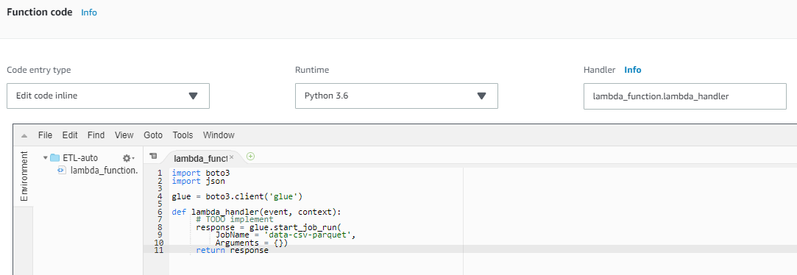

## Appendix-Trigger ETL job with Lambda function

### Create a Lambda function in order to automate ETL job with glue (automated ETL job)

* 	On the **Services** menu, click **Lambda**.

* 	Click **Create function**.

* 	Choose **Author from scratch**.

* 	Enter function Name **ETL-auto**.

* 	Select **python 3.6** in **Runtime** blank.

* 	Select **Choose an existing role** in Role blank and choose **LambdaAutoETL** as **Existing role**.

    

* 	Click **Create function**.

* Scroll down to the **Function code** section, then delete all of the code that appears in the code editor.

* Copy below code, and paste it into the code editor:

      import boto3
      import json

      glue = boto3.client('glue')

      def lambda_handler(event, context):
           # TODO implement
           response = glue.start_job_run(
               JobName = 'data-csv-parquet',
               Arguments = {})
           return response
 
   

* Scroll to **Add triggers** at top of the page.

* Under **Add triggers**, click **S3**.

* Scroll down to **Configure triggers** and use these settings:

    * Select bucket **“yourname-dataset”** as Bucket.
    
    * Select **All Object create events** as **Event type**.
    
    * Remember to check **Enable trigger** box.

* Click **Add**.

* 	Click **Save** to save the change of function.

* 	Now you can re-upload **USvideos.csv** file into **yourname-dataset** bucket again to test that whether this Lambda function operating normally.

* 	After you upload a csv file into **yourname-dataset** bucket, AWS Glue will run the job **“data-csv-parquet”**. The **History** console will show the job is running if your Lambda function is correct.

## Clean Up

## Congratulations! You now have learned how to:

