# Trigger Lambda function to do ETL with Glue

After you upload data into S3, then trigger a Lambda function to do ETL automatically which is a type of data integration that refers to the three steps (Extrect, Transform and Load) used to blend data from multiple sources, here we will use [AWS Glue](https://aws.amazon.com/tw/glue/) to do it. [How it works?](https://docs.aws.amazon.com/glue/latest/dg/how-it-works.html)

## Prerequisites

* Make sure the region is **US East (N. Virginia)**, which its short name is **us-east-1**.

## Setup data catalog in AWS Glue

The AWS Glue Data Catalog is your persistent metadata store. It is a managed service that lets you store, annotate, and share metadata in the AWS Cloud in the same way you would in an Apache Hive metastore. Now we will create database, tables, crawlers, jobs in AWS Glue.

### Add crawler

1.	On the **Services** menu, click **AWS Glue**.

2. 	Choose **Database** in the navigation pane, choose **Add database**. 

3.  In the **Database name**, type **my-data**, and choose **Create**.

4. 	Choose **Crawlers** in the navigation pane, choose **Add crawler**. 

5.  Type Crawler name **data-crawler**, and choose **Next**.

6. 	On the **Add a data store** page, choose **S3** as data store.

7. 	Select **Specified path in my account**.

8. 	Select the bucket that you create first (**“yourname-dataset”**), and choose **Next**.

    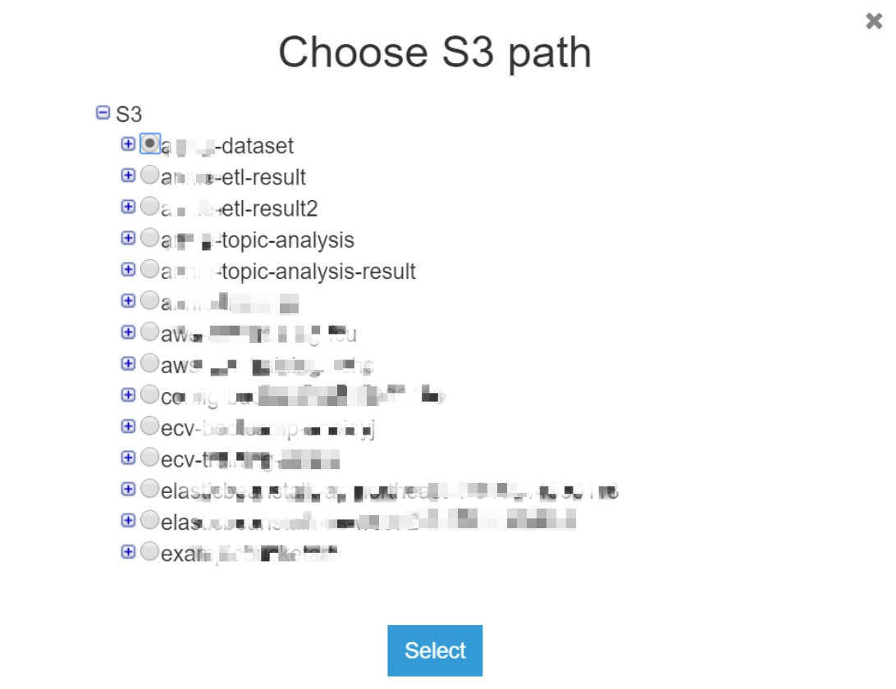

9. 	On **Add another data store** page, choose **No**, and choose **Next**.

10. Select **Choose an existing IAM role**, and choose the role **AWSGlueServiceRoleDefault** you just created in the drop-down list, and choose **Next**.

11. For **Frequency**, choose **Run on demand**, and choose **Next**.

12. For **Database**, choose **my-data**, and choose **Next**.

13. Review the steps, and choose **Finish**.

14. The crawler is ready to run. Choose **Run crawler**.

15. When the crawler has finished, two table has been added. Choose **Tables** in the left navigation pane, and then choose **usvideos_csv** to confirmed.

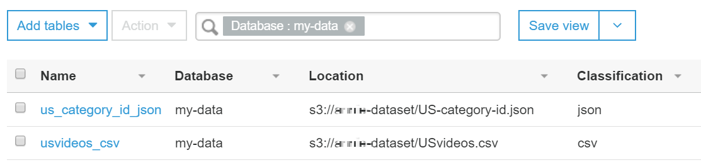

 *  Click in to see more information about the document.

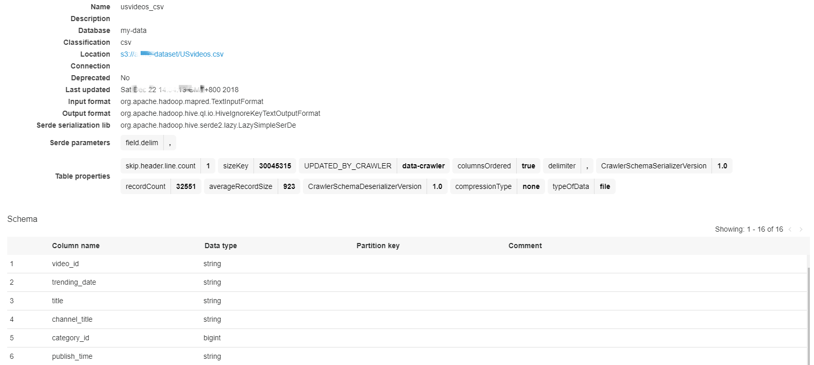

Now you finish the crawler setting, and going to create a job to transform data type.

### Add jobs to transform the Data from CSV to Parquet format

1. 	In the navigation pane, under **ETL**, choose **Jobs**, and then choose **Add job**.

2. 	On the Job properties, enter the following details:

    * **Name: data-csv-parquet**

    * **IAM role:** choose **AWSGlueServiceRoleDefault**

3. 	For **This job runs**, select **A proposed script generated by AWS Glue**.

4. 	Choose **Next**.

5. 	Choose **usvideos_csv** as the data source, and choose **Next**.

6. 	Choose **Create tables in your data target**.

7.	For Data store, choose **Amazon S3**, and choose **Parquet** as the format.

8.	For **Target path**, select S3 bucket with **“yourname-etl-result”** that you created before to store the results.

    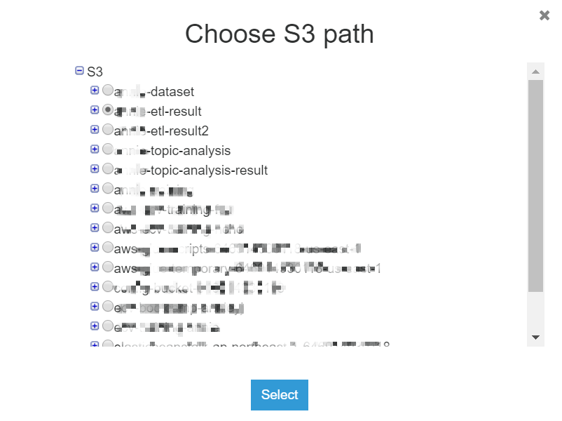

9. 	Verify the schema mapping, and choose **Next**. 

10. Click **Next** and click **Save job and edit script**. Skip Script editor tips.

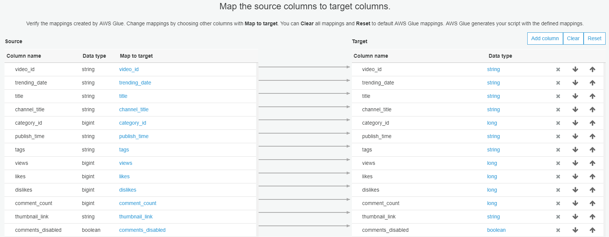

11. View the job. This screen provides a complete view of the job and allows you to edit, click **Save**, and choose **Run job**. This steps may be waiting around 10 minutes.

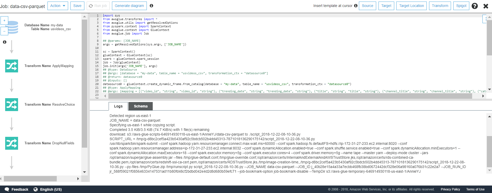

12. When job finished, go to your S3 bucket **“yourname-etl-result”** ensure there is a parquet file that means your job succeed.

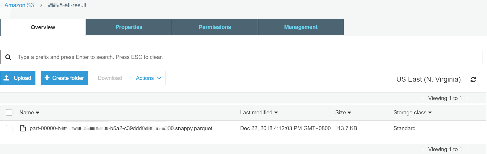

### Add another parquet table and crawler for USvideos.csv

1. 	When the job has finished, add a new table for the Parquet data using a crawler.

2. 	In the navigation pane, choose **Add crawler**. Add type Crawler name **parquet-crawler1** and choose **Next**.

3. 	Choose **S3** as the **Data store**.

4. 	Include path choose your S3 bucket **“yourname-etl-result”** to store data.

5. 	Choose **Next**.

6.	On **Add another data store** page, choose **No**, and choose **Next**.

7. 	Select **Choose an existing IAM role**, and choose the role **AWSGlueServiceRoleDefault** you just created in the drop-down list, and choose **Next**.

8. 	For **Frequency**, choose **Run on demand**, and choose **Next**.

9. 	For **Database**, choose **my-data**, and choose **Next**.

10. Review the steps, and choose **Finish**.

11. The crawler is ready to run. Choose **Run it now**.

12. After the crawler has finished, there is a new table in the **my-data** database:

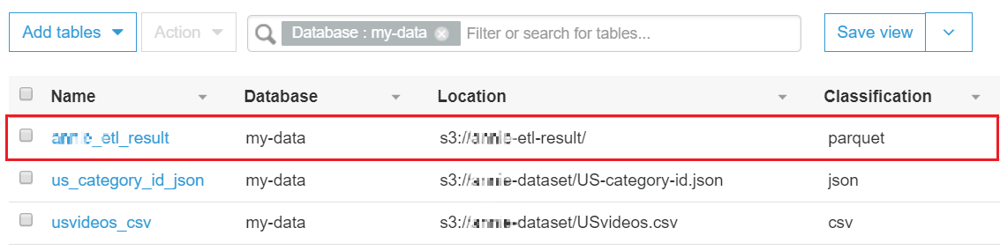

13. That means you finish the ETL process of csv to parquet format **(USvideos.csv)**.

### Add jobs for data of US-category-id.json

In order to analyze the channel category, we need to perform another job in Glue data catalog which contains category data (**US-category-id.json**).

1. 	In the navigation pane, under **ETL**, choose **Jobs**, and then choose **Add job**.

2. 	On the Job properties, enter the following details:

    * **Name: data-json-parquet**

    * **IAM role:** choose **AWSGlueServiceRoleDefault**

3. 	For **This job runs**, select **A proposed script generated by AWS Glue**.

4. 	Choose **Next**.

5.	Choose **us-category-id_json** as the data source, and choose **Next**.

6. 	Choose **Create tables in your data target**.

7.	For Data store, choose **Amazon S3**, and choose **Parquet** as the format.

8. 	For **Target path**, select S3 bucket with **“yourname-etl-result2”** that you created before to store the results.

    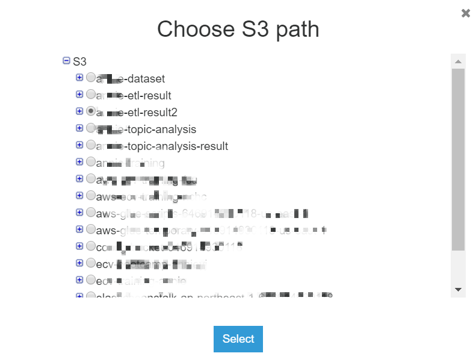

9. 	Verify the schema mapping, and choose **Next**. 

10. Click **next** and click **Save job and edit script**.

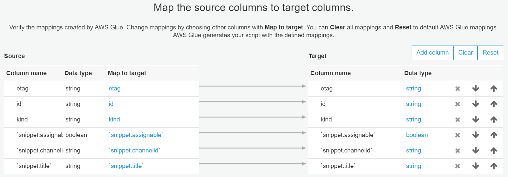

11. View the job. This screen provides a complete view of the job and allows you to edit, click **Save**, and choose **Run job**. This steps may be waiting around 10 minutes.

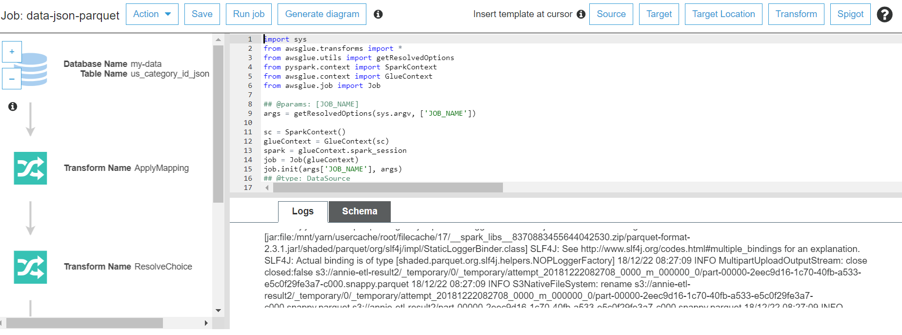

12. When job finished, go to your S3 bucket **“yourname-etl-result2”** ensure there is a parquet file that means your job succeed.

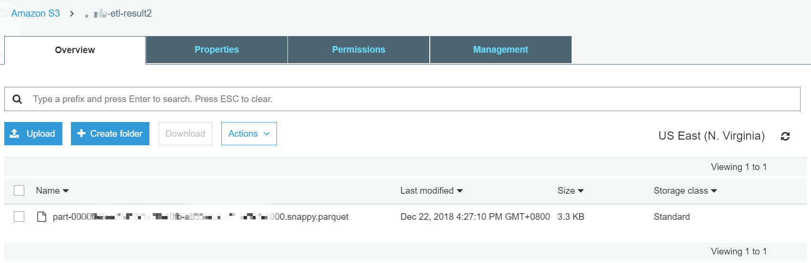  
 
Now you need to add another parquet table and crawler

13. When the job has finished, add a new table for the Parquet data using a crawler.

14. In the navigation pane, choose **Add crawler**. Add type Crawler name **parquet-data2** and choose **Next**.

15. Choose **S3** as the **Data store**.

16. Include path choose your S3 bucket **“yourname-etl-result2”** to store data.

17. Choose **Next**.

18. On **Add another data store** page, choose **No**, and choose **Next**.

19. Select **Choose an existing IAM role**, and choose the role **AWSGlueServiceRoleDefault** you just created in the drop-down list, and choose **Next**.

20. For **Frequency**, choose **Run on demand**, and choose **Next**.

21. For **Database**, choose **my-data**, and choose **Next**.

22.	Review the steps, and choose **Finish**.

23. The crawler is ready to run. Choose **Run it now?**.

24. After the crawler has finished, there is a new table in the **my-data** database:

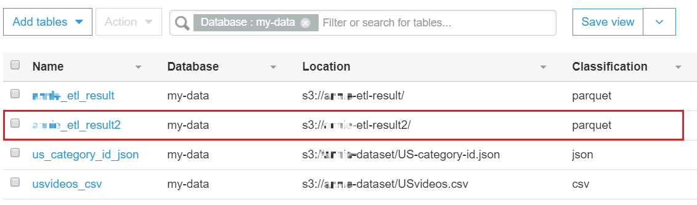

Next step you will learn how to trigger ETL job with Lambda function automatically

## Furthermore

* Read [Appendix-Trigger ETL job with Lambda function](Appendix-Trigger-ETL-job-with-Lambda-function.md) in order to trigger a Lambda function **automatically**.

## Clean Up

* Go to **S3** and **delete** buckets you create.

* Go to **AWS Glue**, click **my-data** and click **Action** and **Delete Table**.

* In the navigation pane, under **ETL**, choose **Jobs** and click  **Action** and **Delete**.

* Go to **Crawlers**, click **data-crawler** and click **Action** and **Delete Crawler**.

## Congratulations! You now have learned how to:

*  Processing ETL job manually using AWS Glue and Amazon S3.

*  Crawler your data to Amazon S3 by AWS Glue.

*  Setup an automated ETL job with Lambda function.

### Now you are ready to use [AWS Comprehend to do topic modeling job](https://github.com/ecloudvalley/Serverless-ETL-and-data-analysis-on-AWS/tree/master/Using%20AWS%20Comprehend%20do%20topic%20modeling%20job)

