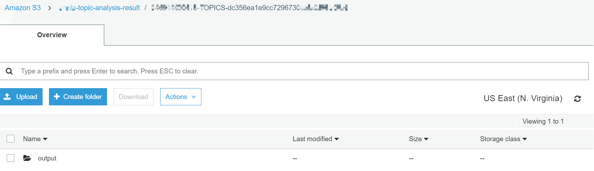
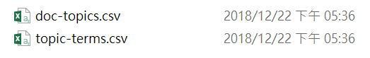
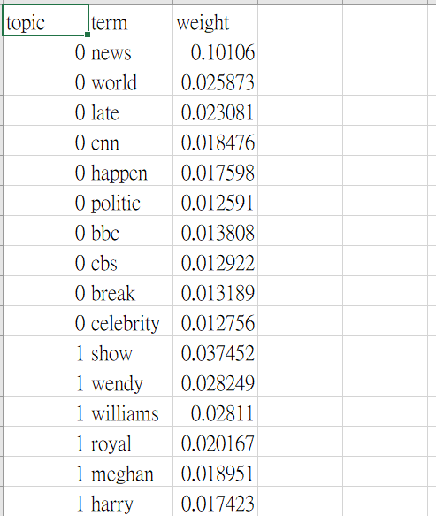

## Automated topic modeling job

### Create a Lambda to trigger topic detection jobs by Amazon Comprehend

1. 	On the **Services** menu, click **Lambda**.

2. 	Click **Create function**.

3. 	Choose **Author from scratch**.

4. 	Enter function Name: **comprehend-lambda**.

5. 	Select **python 3.6** in **Runtime** blank.

6. 	Select **Choose an existing role** in **Role** blank and choose **Comprehend-Job** as **Existing role**.

7. 	Click **Create function**.

8. 	Click **comprehend-lambda** blank in **Designer** and replace original code that existing in **Function code** editor with below code

    *   Input_s3_url = “s3://yourname-topic-analysis”
    
    *   output_s3_url = "s3://yourname-topic-analysis-result"
    
    *   data_access_role_arn = "arn:aws:iam::xxxxxxxxxxxx:role/service-role/AmazonComprehendServiceRoleS3FullAccess-user"
        (The arn of IAM role that you create in Amazon Comprehend console)
 
 
            import boto3
            import json

            def lambda_handler(event, context):
               # TODO implement
               comprehend = boto3.client(service_name='comprehend', region_name='us-east-1')
               input_s3_url = "s3://yourname-topic-analysis"
               input_doc_format = "ONE_DOC_PER_LINE"
               output_s3_url = "s3://yourname-topic-analysis-result"
               data_access_role_arn = "arn:aws:iam::xxxxxxxxxxxx:role/service-role/AmazonComprehendServiceRoleS3FullAccess-user"
               number_of_topics = 50

               input_data_config = {"S3Uri": input_s3_url, "InputFormat": input_doc_format}
               output_data_config = {"S3Uri": output_s3_url}

               start_topics_detection_job_result = comprehend.start_topics_detection_job(NumberOfTopics=number_of_topics,
                                                                                       InputDataConfig=input_data_config,
                                                                                       OutputDataConfig=output_data_config,
                                                                                       DataAccessRoleArn=data_access_role_arn)
               return start_topics_detection_job_result
 

9. 	In **configuration**, click **S3** below **Add triggers** to add trigger for **comprehend-lambda** function

10. and drop down to **Configure triggers** part, select bucket **“yourname-topic-analysis”** as Bucket, select **All Object create events** as **Event type**. Remember to check Enable trigger box then you click **Add**.

11. Click **Save** to save the change of function.

12. Now you can re-upload a csv file into **“yourname-topic-analysis”** bucket to test that whether this Lambda function operating normally.

13. On the **Services** menu, click **S3**.

14. Click **yourname-topic-analysis** bucket.

15. Click **Upload**.(Upload again)

16. Click **Add files**.

17.	Select file **word_analysis.csv** and click **Upload**.

18. When it upload finish go to your **Amazon comprehend** console.

19. **You will find a new job is running**.

20. Download the output of job in **yourname-topic-analysis-result** bucket after job completed which is a result from topic modeling.

21. Click **output** you will see a file **output.tar.gz**.

22. Download the file you will get the topic modeling result as csv file.

    

    

