# Using AWS Comprehend do topic modeling job

You use AWS Glue to set up and manage your extract, transform, and load (ETL) workload. To set up crawlers that scan data in Amazon S3, classify it, extract schema information from it, and store the metadata automatically in the AWS Glue Data Catalog. Then trigger a Lambda function to automate ETL job.

Next, let's use Amazon Comprehend to create and manage asynchronous topic detection jobs.

## Prerequisites

* Make sure the region is **US East (N. Virginia)**, which its short name is **us-east-1**.

## Setup topic detection jobs by Amazon Comprehend

Amazon Comprehend uses a pre-trained model to examine and analyze a document or set of documents to gather insights about it. This model is continuously trained on a large body of text so that there is no need for you to provide training data. Topic modeling can search the content of documents to determine common themes and topics.

### To create a topic detection job

1. 	On the **Services** menu, click **Amazon Comprehend**.

2.   Click **Try Amazon Comprehend**.

3.   Click **switch to the old console** on the top of console.

4. 	In the navigation pane, click **Topic modeling**.

5. 	Click **Create**.

6. 	Select **My data (S3)** as input data.

7. 	For **S3 data location** of input data, enter the URL of **“yourname-topic-analysis”** bucket **(e.g., s3://james-topic-analysis/)**.

8. 	For Input format, select **One document per line**.

9. 	Enter **50** for **Numbers of topic**.

10. For **Job Name**, enter **first_job**.

11. For **S3 data location** of output data, enter the URL of **“yourname-topic-analysis-result” (e.g., s3://james-topic-analysis-result/)**.

12. Select **Create a new IAM role** in **Select an IAM role** blank.

13. For **Permission to access** select **any S3 bucket**.

14. For **Name suffix** enter **user**.

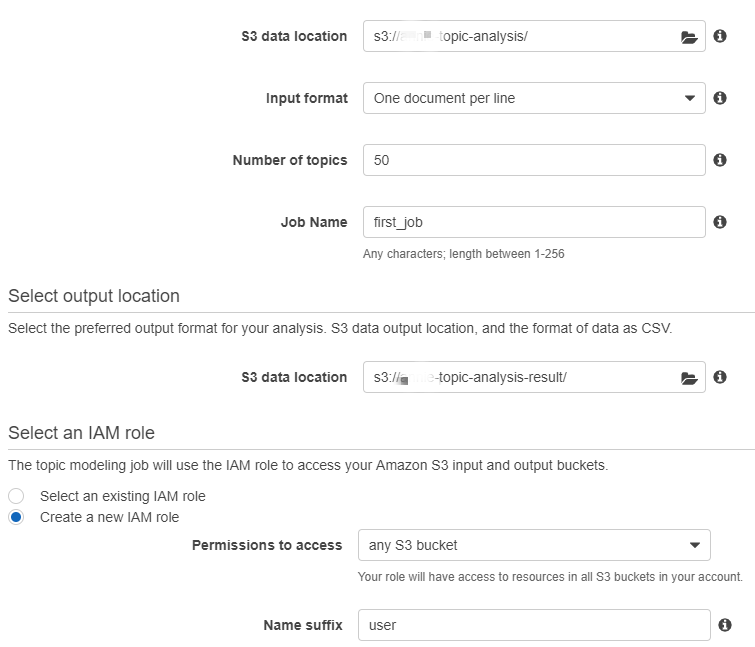

15. Click **Create job** to create and start the topic detection job.

16. It will take a few time running.

    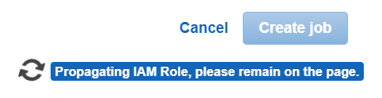

17. Then you will see your job is running.

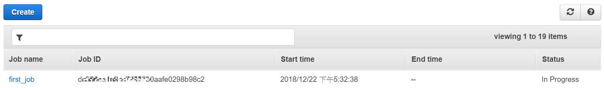

18. When the job complete the status change to *Completed*. You can click reflesh icon if waiting a while.

19. After job completed, you will find a new output in **yourname-topic-analysis-result** bucket in Amazon S3.

20. Click below folder:

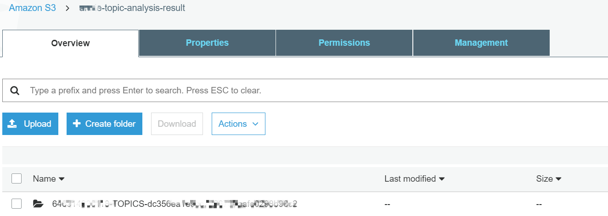

21. Click **output** you will see a file **output.tar.gz**.

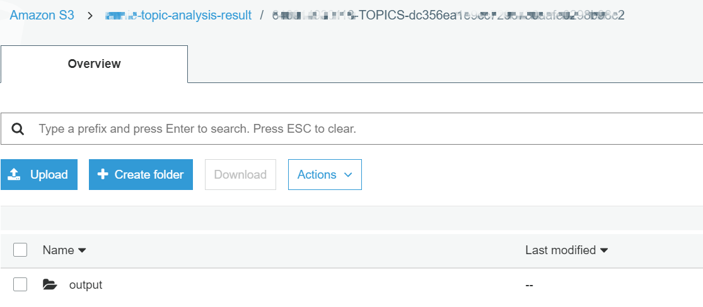

22. Download the file, unzip it and you will get the topic modeling result as csv file.

    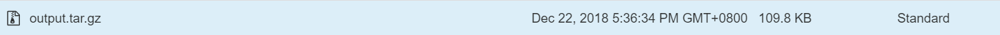

     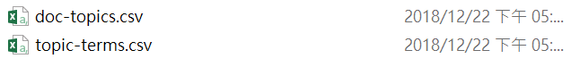

## Automated topic modeling job

### Create a Lambda to trigger topic detection jobs by Amazon Comprehend

1. 	On the **Services** menu, click **Lambda**.

2. 	Click **Create function**.

3. 	Choose **Author from scratch**.

4. 	Enter function Name: **comprehend-lambda**.

5. 	Select **python 3.6** in **Runtime** blank.

6. 	Select **Choose an existing role** in **Role** blank and choose **Comprehend-Job** as **Existing role**.

7. 	Click **Create function**.

8. 	Click **comprehend-lambda** blank in **Designer** and replace original code that existing in **Function code** editor with below code

    *   Input_s3_url = “s3://yourname-topic-analysis”
    
    *   output_s3_url = "s3://yourname-topic-analysis-result"
    
    *   data_access_role_arn = "arn:aws:iam::xxxxxxxxxxxx:role/service-role/AmazonComprehendServiceRoleS3FullAccess-user"
        (The arn of IAM role that you create in Amazon Comprehend console)
 
 
            import boto3
            import json

            def lambda_handler(event, context):
               # TODO implement
               comprehend = boto3.client(service_name='comprehend', region_name='us-east-1')
               input_s3_url = "s3://yourname-topic-analysis"
               input_doc_format = "ONE_DOC_PER_LINE"
               output_s3_url = "s3://yourname-topic-analysis-result"
               data_access_role_arn = "arn:aws:iam::xxxxxxxxxxxx:role/service-role/AmazonComprehendServiceRoleS3FullAccess-user"
               number_of_topics = 50

               input_data_config = {"S3Uri": input_s3_url, "InputFormat": input_doc_format}
               output_data_config = {"S3Uri": output_s3_url}

               start_topics_detection_job_result = comprehend.start_topics_detection_job(NumberOfTopics=number_of_topics,
                                                                                       InputDataConfig=input_data_config,
                                                                                       OutputDataConfig=output_data_config,
                                                                                       DataAccessRoleArn=data_access_role_arn)
               return start_topics_detection_job_result
 

9. 	In **configuration**, click **S3** below **Add triggers** to add trigger for **comprehend-lambda** function

10. and drop down to **Configure triggers** part, select bucket **“yourname-topic-analysis”** as Bucket, select **All Object create events** as **Event type**. Remember to check Enable trigger box then you click **Add**.

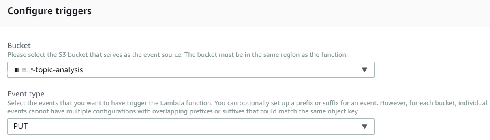

11. Click **Save** to save the change of function.

12. Now you can re-upload a csv file into **“yourname-topic-analysis”** bucket to test that whether this Lambda function operating normally.

13. On the **Services** menu, click **S3**.

14. Click **yourname-topic-analysis** bucket.

15. Click **Upload**.(Upload again)

16. Click **Add files**.

17.	Select file **word_analysis.csv** and click **Upload**.

18. When it upload finish go to your **Amazon comprehend** console.

19. **You will find a new job is running**.

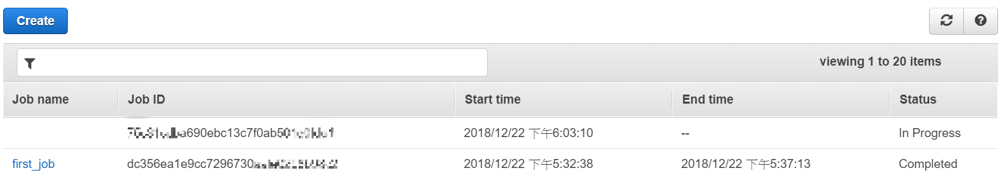

20. Download the output of job in **yourname-topic-analysis-result** bucket after job completed which is a result from topic modeling.

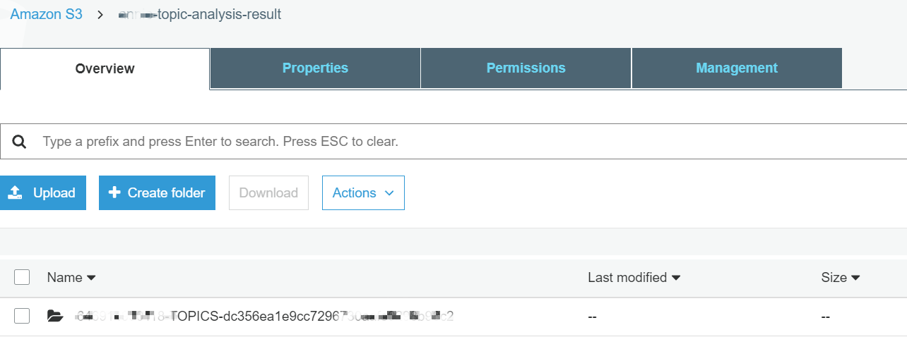

21. Click **output** you will see a file **output.tar.gz**.

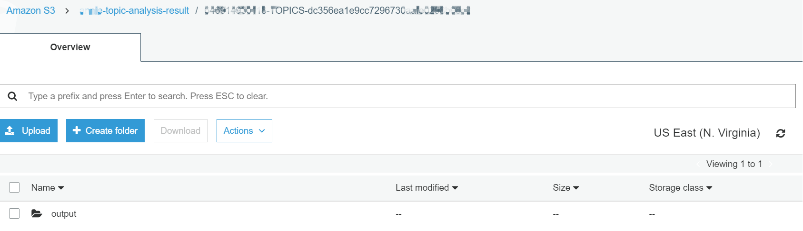

22. Download the file you will get the topic modeling result as csv file.

    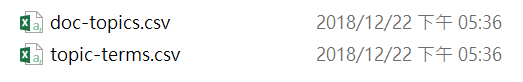

    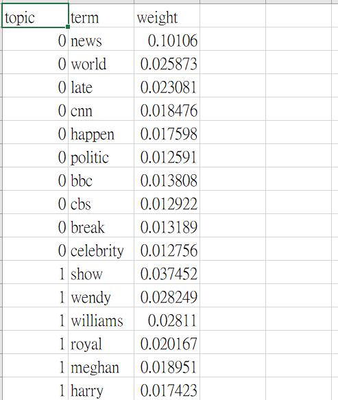

## Clean Up

* Go to **S3** and **delete** buckets you create.

## Congratulations! You now have learned how to:

*  Using AWS Comprehend do topic modeling job.

*  Setup an automated topic modeling job with Lambda function.

### Now you are ready to analyze the data with Athena or Redshift

* [Analyze data with Athena](https://github.com/ecloudvalley/Serverless-ETL-and-data-analysis-on-AWS/tree/master/Analyze%20and%20visualize%20the%20data%20with%20Athena%20and%20QuickSight)

* [Analyze data with Redshift](https://github.com/ecloudvalley/Serverless-ETL-and-data-analysis-on-AWS/tree/master/Analyze%20and%20visualize%20the%20data%20with%20Redshift%20and%20QuickSight)
