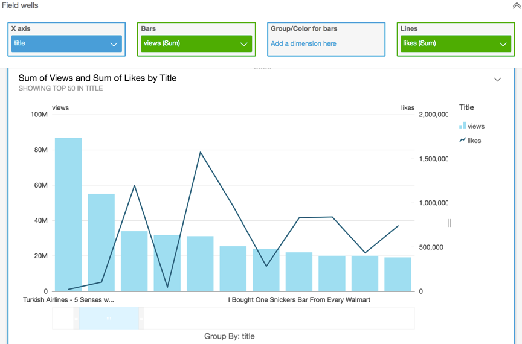

# Analyze and visualize the data with Redshift and QuickSight

You use Amazon Comprehend to examine and analyze a document to determine common themes.

Next, we will use Redshift to do data analysis that often processing structural data query job for long term workflow. Then use Amazon BI tool - QuickSight, it is a business analytics service you can use to build visualizations, perform ad hoc analysis, and get business insights from your data. It can automatically discover AWS data sources and also works with your data sources.

## Data analysis with Redshift and connect to AWS Glue

After finish analyzing data in Athena, get start with data analysis with Amazon Redshift. Different from Athena, it is recommended to use Amazon Redshift on large sets of structured data. It is scalable enough that even if new nodes are added to the cluster, it can be easily accommodated with few configuration changes.

Amazon Redshift is a petabyte-scale data warehouse used together with business intelligence tools for modern analytical solutions. Unlike Athena, Redshift requires a **cluster** for which we need to upload the data extracts and build tables before we can query. 

### Setting up VPC for Redshift

First setup VPC in which you want to create your cluster.

1. On the **Services** menu, click **VPC**.

2. Click **Launch VPC Wizard**.

3. In this workshop we simply choose **VPC with a single Public Subnet**, click **Select**.

4. Enter your VPC name: **Redshift-VPC**.

5. Click **Add Endpoint** below **Service endpoints** and select **com.amazonaws.us-east-1.s3** as service.

6. Click **Create VPC**.

7. In the navigation pane, choose **Security Groups**.

8. Select the Security Group that attach on **Redshift-VPC** which group name is **default** then select **Inbound Rules**.

9. Click **Edit rules**.

10. Click **Add Rule** below, type for **ALL Traffic**, Source for **0.0.0.0/0**.

11. Click **Save rules**, and **Close**.

### Setting up Redshift

1. On the **Services** menu, click **Amazon Redshift**.

2. In the navigation pane, choose **Security**.

3. Select **Subnet Groups** and click **Create Cluster Subnet Group**.

4. Enter the Name: **redshift-sg**.

5. Enter the Description: **SG for redshift**.

6. Select the **VPC ID** (vpc-xxxxxxxx) same as **Redshift-VPC** that you create before.

7. Click **add all the subnets** then click **Create**.

8. In the navigation pane, choose **Clusters**.

9. Click **Launch cluster**.

10. Enter Cluster identifier: **my-cluster**.

11. Enter Database name: **mydb**.

12. Leave **Database port** for **5439**.

13. Enter your own **Master user name** and **Master user password** and type again your password in **Confirm password** then click **Continue**. (e.g., Master user name: james, Master user password: James123), click **Continute**.

14. Select **dc2.large** for the **Node type** which is the cheapest cluster.

15. Click **Continue**.

16. Select VPC ID of **Redshift-VPC** in **Choose a VPC** blank.

17. In **Available roles** choose **SpectrumRole** then click **Continue**.

18. After examine that all setting is correct, click **Launch cluster**.

19. It will need 10-15 minutes passed before the cluster was ready to use.
    

### Connect to AWS Glue

1. On the **Services** menu, click **AWS Glue**.

2. In the navigation pane, choose **Connections**.

3. Click **Add connection**.

4. Enter Connection name: **redshift-connection**.

5. Select Connection type **Amazon Redshift**.

6. choose **Require SSL connection**, and click **Next**.

7. Select **my-cluster** in **Cluster** blank.

8. Enter Database name: **mydb**.

9. Enter your own **Username** and **Password** then click **Next**.

10. Click **Finish**.

11. Select **redshift-spectrum**, and click **Test connection**.

12. Select **AWSGlueServiceRoleDefault** as **IAM role**, and click **Test connection**. You will find below screen after testing.

13. On the **Services** menu, click **AWS Glue**.

14. In the navigation pane, choose **Jobs**.

15. Click **Add job**.

16. Enter the Name: **redshift-query**.

17. Select **AWSGlueServiceRoleDefault** as **IAM role**, and click **Next**.

18. Select **usvideos_csv**, and click **Next**.

19. Choose **Create tables in your data target**.

20. Select **Data store** as **JDBC**.

21. Select **redshift-connection** for **Connection** and enter the **Database name: mydb** then click **Next**.

22. Click **Save job and edit script** you will find this screen below.

23. Click **Save job and edit script**.

24. View the job. This screen provides a complete view of the job and allows you to edit, click **Save**, and choose **Run job**. This steps may be waiting around 10 minutes.

    * In this job, AWS Glue send data to Redshift cluster and processing data by the cluster.

## Data visualization with QuickSight

### Setting Up Amazon QuickSight

1. Go to AWS Services page by searching **Quicksight** by AWS Services search bar.

    * Please confirm the user have Administrator permission to sign up QuickSight.

2. Provide your email address on **Welcome to QuickSight page**. Click **Continue** and **Next** until to finish **Get Started**.

3. Click **Sign up for QuickSight**.

4. Choose **Standard**, click **Continue**. 
 
5. Provide requested information and setting then click on **Finish**.

    * Type in a your **email** address to receive Amazon QuickSight service and usage notifications.

6. It takes a while to enable your account.

7. Finish register you will find the screen below:

8. If you are new to QuickSight, the analyses board will be empty, now we can get start with **QuickSight**.

### Create an Analysis with Redshift
 
1. 	Back to QuickSight home page and click **New analysis**.

2. 	Click **New data set** and select **Redshift (Manual connect)**.

3.	Enter Data source name **RedshiftBI**

4. 	Enter **Database server** as your redshift cluster **Endpoint**.

    * e.g., my-cluster.ceng4yniaba2.us-east-1.redshift.amazonaws.com

5. 	Enter Port **5439**.

6. 	Enter **Database name: mydb**.

7. 	Enter your **Username** and **Password** of redshift cluster that you create before.

8. 	Click **Validate connection**.

9. 	Click **Create data source**.

10. Select **usvideos_csv** as table and click **Select**.

11. Click **Visualize**.

12. Select a **Visual types** then drag the field items which below **Fields list** into **Field wells** and you can create different BI charts just like Athena data source.

13. Now we import the result of topic modeling data (**topic-terms.csv**) to integrate with QuickSight.

14. Back to **QuickSight** console.

15. Click **New analysis**.

16. Click **New data set**.

17. Click **Upload a file**.

18. Select **topic-terms.csv** and upload.

19. Click **Next**.

20. Click **Visualize**

21. Select a **Visual types** then drag the field items which below **Fields list** into **Field wells** and you can create different BI charts.

22. For example, **horizontal stacked bar chart** shows that sum of weight by term. We can know that the word **president** is often appears in US videos.

* You can query certain trending topic of **title** to do several analytics. For example, video relate to **President**.

23. Back to your QuickSight data sets page click **New data set**.

24. Choose **Athena** and enter data source name **President**. 

25. Select **yourname_etl_result** in **my-data** database and click **Edit / Preview data**

26. In the navigation pane under **Tables**, select **Use SQL**.

27. Enter SQL name **President** and paste below code in Custom SQL field.

         Select * From "my-data"."yourname_etl_result" where title like '%President%'; 

    *  It means for the title that contain “President”

28.	Click Finish then Click on **Save & visualize**.

29. Then you can create several plots of **President title video**. For example, Pie Chart in this case.

## Clean Up

* Go to **Redshift**, click **Clusters** and shut down clusters.

## Congratulations! You now have learned how to:

* Setting up Redshift.

* Adding a Redshift to determine the underlying JDBC properties to create the connection.

* Visualize data on QuickSight with Redshift.

* You now have finished whole Lab and have learned how to do **Serverless ETL with AWS Glue & BI process with QuickSight**.
