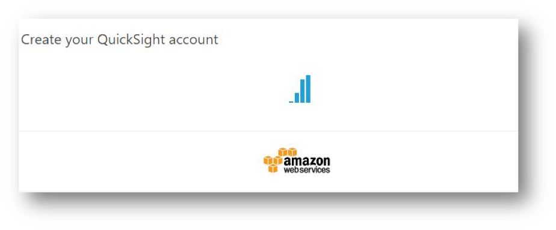

# Analyze and visualize the data with Athena and QuickSight

You use Amazon Comprehend to examine and analyze a document to determine common themes.

Next, we will use Athena to query the data in an easy way, and use Amazon BI tool - QuickSight, it is a business analytics service you can use to build visualizations, perform ad hoc analysis, and get business insights from your data. It can automatically discover AWS data sources and also works with your data sources.

## Prerequisites

* Make sure the region is **US East (N. Virginia)**, which its short name is **us-east-1**.

## Start sorting data by using Athena

Amazon Athena is an interactive query service that makes it easy to analyze data directly in Amazon S3 using standard SQL. It is a serverless service and does not need any infrastructure to create, manage, or scale data sets. It works directly on top of Amazon S3 data sets. It creates external tables and therefore does not manipulate S3 data sources, working as a read-only service from an S3 perspective. 

* On the **Services** menu, click **Athena**.

* Choose **Get Started** to open the Query Editor while your first time visiting the Athena console. If it isn't your first time, the Athena Query Editor opens.

* On the **Query Editor** tab, choose the database **my-data**.

* Choose the **yourname_etl_result** table.

* Query the data, type below standard SQL:

    **Note:** remember to change table name, for example, *Select * From "my-data"."james_etl_result" limit 100;*

         Select * From "my-data"."yourname_etl_result" limit 100;
        	
* Click **Run Query** and results are returned that look like the following:

* Choose the **yourname_etl_result2** table.

* Query the data, type below standard SQL:

    **Note:** remember to change table name, for example, *Select * From "my-data"."james_etl_result2";*

         Select * From "my-data"."yourname_etl_result2";

* Click **Run Query** and results are returned that look like the following:

 
 

## Data visualization with QuickSight

### Setting Up Amazon QuickSight

* Go to AWS Services page by searching **Quicksight** by AWS Services search bar.

    * Please confirm the user have Administrator permission to sign up QuickSight.

* Provide your email address on **Welcome to QuickSight page**. Click **Continue** and **Next** until to finish **Get Started**.

* Click **Sign up for QuickSight**.

* Choose **Standard**, click **Continue**. 
 
* Provide requested information and setting then click on **Finish**.

    * Type in a your **email** address to receive Amazon QuickSight service and usage notifications.

* It takes a while to enable your account.

* Finish register you will find the screen below:

* If you are new to QuickSight, the analyses board will be empty, now we can get start with **QuickSight**.

### Create an Analysis with Athena

* 	Click **Manage data** and you will see this screen. If you were first time log in QuickSight console, there is no data sets record.

* 	Click **New data set** and you will find that many data sources.

* 	Click on **Athena** and enter **AthenaBI** in **Data source name**, then click **Validate connection**.

* 	Click **Create data source** and select **my-data** database. For tables, choose **yourname_etl_result** and click **Select**.

* 	When loading finish click **Visualize**.

* 	Select a **Visual types** (e.g., Vertical bar chart).

* 	Drag the field items which below **Fields list** into **Field wells** and you can create different BI charts.

* This chart analyze that whether views and comment impact on likes. The video **“Falcon Heavy Test Flight”** is one of the example that really affected.

* 	You can analyze the channel type of the video by **yourname_etl_result2 bucket** using Athena (e.g., Entertainment).

*	Create a **New data set** and choose **Athena** as data sources.

* 	Select database **my-data** and select the table **yourname_etl_result2**.

*	Click **Select** and **Visualize**.

* 	Select table chart to display the title and id of category.

* You can query certain **category id** to do several analytics.

* 	Back to your QuickSight data sets page click **New data set**.

* 	Choose **Athena** and enter data source name **Entertainment**. 

* 	Select **yourname_etl_result** in **my-data** database and click **Edit / Preview data**

* 	In the navigation pane under **Tables**, select **Use SQL**.

* 	Enter SQL name **Entertainment** and paste below code in Custom SQL field.

         Select * From "my-data"."yourname_etl_result" where category_id = 24;

    *  category_id =24 for Entertainment category.

* 	Click **Finish** then Click on **Save & visualize**.

* 	Then you can start customize your chart to do your BI strategy. This plot shows the factors that impact Entertainment video type in this query case.

## Congratulations! You now have learned how to:

* Visualize data on Quicksight with Athena. 

* You now have finished whole Lab and have learned how to do **Serverless ETL with AWS Glue & BI process with QuickSight**. 
