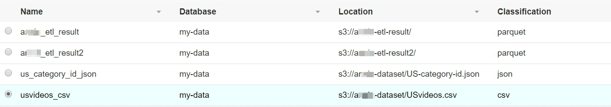

## Data analysis with Redshift and connect to AWS Glue

After finish analyzing data in Athena, get start with data analysis with Amazon Redshift. Different from Athena, it is recommended to use Amazon Redshift on large sets of structured data. It is scalable enough that even if new nodes are added to the cluster, it can be easily accommodated with few configuration changes.

Amazon Redshift is a petabyte-scale data warehouse used together with business intelligence tools for modern analytical solutions. Unlike Athena, Redshift requires a **cluster** for which we need to upload the data extracts and build tables before we can query. 

### Setting up VPC for Redshift

First setup VPC in which you want to create your cluster.

* On the **Services** menu, click **VPC**.

* Click **Launch VPC Wizard**.

* In this workshop we simply choose **VPC with a single Public Subnet**, click **Select**.

* Enter your VPC name: **Redshift-VPC**.

* Click **Add Endpoint** below **Service endpoints** and select **com.amazonaws.us-east-1.s3** as service.

* Click **Create VPC**.

* In the navigation pane, choose **Security Groups**.

* Select the Security Group that attach on **Redshift-VPC** which group name is **default** then select **Inbound Rules**.

* Click **Edit rules**.

* Click **Add Rule** below, type for **ALL Traffic**, Source for **0.0.0.0/0**.

* Click **Save rules**, and **Close**.

### Setting up Redshift

* On the **Services** menu, click **Amazon Redshift**.

* In the navigation pane, choose **Security**.

* Select **Subnet Groups** and click **Create Cluster Subnet Group**.

* Enter the Name: **redshift-sg**.

* Enter the Description: **SG for redshift**.

* Select the **VPC ID** (vpc-xxxxxxxx) same as **Redshift-VPC** that you create before.

* Click **add all the subnets** then click **Create**.

* In the navigation pane, choose **Clusters**.

* Click **Launch cluster**.

* Enter Cluster identifier: **my-cluster**.

* Enter Database name: **mydb**.

* Leave **Database port** for **5439**.

* Enter your own **Master user name** and **Master user password** and type again your password in **Confirm password** then click **Continue**. (e.g., Master user name: james, Master user password: James123), click **Continute**.

* Select **dc2.large** for the **Node type** which is the cheapest cluster.

* Click **Continue**.

* Select VPC ID of **Redshift-VPC** in **Choose a VPC** blank.

* In **Available roles** choose **SpectrumRole** then click **Continue**.

* After examine that all setting is correct, click **Launch cluster**.

* It will need 10-15 minutes passed before the cluster was ready to use.
    

### Connect to AWS Glue

* On the **Services** menu, click **AWS Glue**.

* In the navigation pane, choose **Connections**.

* Click **Add connection**.

* Enter Connection name: **redshift-connection**.

* Select Connection type **Amazon Redshift**.

* choose **Require SSL connection**, and click **Next**.

* 	Select **my-cluster** in **Cluster** blank.

* Enter Database name: **mydb**.

* Enter your own **Username** and **Password** then click **Next**.

* Click **Finish**.

* Select **redshift-spectrum**, and click **Test connection**.

* Select **AWSGlueServiceRoleDefault** as **IAM role**, and click **Test connection**. You will find below screen after testing.

* On the **Services** menu, click **AWS Glue**.

* In the navigation pane, choose **Jobs**.

* Click **Add job**.

* Enter the Name: **redshift-query**.

* Select **AWSGlueServiceRoleDefault** as **IAM role**, and click **Next**.

* Select **usvideos_csv**, and click **Next**.

* Choose **Create tables in your data target**.

* Select **Data store** as **JDBC**.

* Select **redshift-connection** for **Connection** and enter the **Database name: mydb** then click **Next**.

* 	Click **Save job and edit script** you will find this screen below.

* 	Click **Save job and edit script**.

* 	View the job. This screen provides a complete view of the job and allows you to edit, click **Save**, and choose **Run job**. This steps may be waiting around 10 minutes.

    * In this job, AWS Glue send data to Redshift cluster and processing data by the cluster.

## Congratulations! You now have learned how to:

* Setting up Redshift.

* Adding a Redshift to determine the underlying JDBC properties to create the connection.

* Visualize data on QuickSight with Redshift.

* You now have finished whole Lab and have learned how to do **Serverless ETL with AWS Glue & BI process with QuickSight**.
